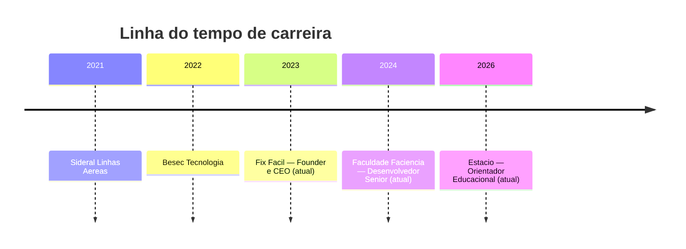

<!-- ====================== BANNER ====================== -->
<div align="center">


<!-- ====================== TYPING ====================== -->
<a href="https://github.com/luisfelipe261099">
  
</a>

<!-- ====================== SOCIAL ====================== -->
<p>
  <a href="https://www.linkedin.com/in/luis-machado-b4038b173/">
    
  </a>
  <a href="https://github.com/luisfelipe261099">
    
  </a>
  
</p>

</div>

<!-- ====================== SOBRE ====================== -->
## &nbsp;👋 &nbsp;Sobre mim

```typescript
const luis = {
  nome: "Luis Felipe Da Silva Machado",
  cargos: [
    "Desenvolvedor Sênior @ Faculdade Faciência",
    "Orientador Educacional @ Estácio",
    "Founder & CEO @ Fix Fácil",
  ],
  formacao: {
    graduacao: "Bacharel em Sistemas de Informação",
    posGraduacao: "Análise de Dados",
  },
  local: "Curitiba, Paraná 🇧🇷",
  experiencia: ["Full Stack Web", "Infraestrutura & Servidores", "Suporte de TI", "Cloud"],
  stack: ["PHP", "TypeScript", "React", "Node.js", "Python", "Google Cloud"],
  sistemas: ["Linux", "Windows"],
  filosofia: "Tecnologia que resolve problemas reais do dia a dia.",
};
```

- 🎓 &nbsp;**Bacharel em Sistemas de Informação** com **Pós-graduação em Análise de Dados**
- 💼 &nbsp;**Desenvolvedor Sênior** na faculdade **Faciência** — desenvolvimento web e sistemas
- 🧭 &nbsp;**Orientador Educacional** na **Estácio**
- 🚀 &nbsp;**Founder & CEO** da **Fix Fácil**, criando tech solutions para desafios do cotidiano
- 🖥️ &nbsp;Anos de experiência em **suporte de TI, infraestrutura e administração de servidores**
- ☁️ &nbsp;Atuação ponta a ponta: do **front-end** ao **back-end**, do **deploy** ao **cloud**
- 🌱 &nbsp;Sempre evoluindo em arquitetura limpa, performance e dados

<br/>

<!-- ====================== TRAJETÓRIA ====================== -->
## &nbsp;🧗 &nbsp;Trajetória profissional

<div align="center">



</div>

| Período | Empresa | Cargo |
|:--:|:--|:--|
| **2026 – Atual** | 🎓 Estácio | Orientador Educacional |
| **2024 – Atual** | 🏫 Faculdade Faciência | Desenvolvedor Sênior |
| **2023 – Atual** | 🚀 Fix Fácil | Founder & CEO |
| **2022** | 💻 Besec Tecnologia | Tecnologia / Desenvolvimento |
| **2021** | ✈️ Sideral Linhas Aéreas | Tecnologia / Suporte & Infra |

<br/>

<!-- ====================== STACK INTERATIVA (DETAILS) ====================== -->
## &nbsp;🛠️ &nbsp;Tech Stack &nbsp;<sub>(clique para expandir cada área)</sub>

<details open>
<summary><b>💻 &nbsp;Desenvolvimento Full Stack</b></summary>
<br/>
<div align="center">


</div>
</details>

<details>
<summary><b>☁️ &nbsp;Cloud & DevOps</b></summary>
<br/>
<div align="center">


</div>
</details>

<details>
<summary><b>🖥️ &nbsp;Infraestrutura & Sistemas</b></summary>
<br/>
<div align="center">


</div>
</details>

<details>
<summary><b>🗄️ &nbsp;Banco de Dados & Análise</b></summary>
<br/>
<div align="center">


</div>
</details>

<br/>

<!-- ====================== PROJETOS ====================== -->
## &nbsp;📌 &nbsp;Projetos em destaque

### &nbsp;⭐ &nbsp;Projetos principais

<table>
<tr>
<td width="50%" valign="top">

#### 🎓 Faciência ERP
**Sistema educacional completo (ERP)**

Plataforma de gestão acadêmica de ponta a ponta, construída por mim para administrar uma instituição de ensino inteira:

- 🗂️ Secretaria acadêmica
- 📜 Emissão de certificados
- 💰 Módulo financeiro
- 👨‍🎓 Portal do aluno
- 📊 Relatórios e gestão integrada

> Meu maior projeto — une back-end robusto, regras de negócio complexas e experiência do usuário.

</td>
<td width="50%" valign="top">

#### 🔧 Fix Fácil System
**Marketplace de assistências técnicas — minha startup**

Plataforma que conecta assistências técnicas a clientes finais, com automação de ponta a ponta:

- 💬 Solicitação de orçamentos automatizada
- 💳 Pagamentos direto pela plataforma
- 🤖 IA que analisa fotos e identifica possíveis problemas
- 🛵 Retirada e rastreio via motoboy
- 🔄 Acompanhamento do reparo em tempo real

> Tecnologia que resolve problemas reais do dia a dia.

</td>
</tr>
</table>

### &nbsp;📂 &nbsp;Outros projetos

<div align="center">

| Projeto | Descrição | Stack |
|:--|:--|:--|
| [**lfm_tecnologia**](https://github.com/luisfelipe261099/lfm_tecnologia) | Plataforma da minha empresa de tecnologia | `TypeScript` |
| [**salesflowsystem**](https://github.com/luisfelipe261099/salesflowsystem) | Sistema de fluxo e gestão de vendas | `PHP` |
| [**sistema_representacao_limpeza**](https://github.com/luisfelipe261099) | Gestão e controle de vendas e representação | `PHP` |
| [**jca-contabilidade**](https://github.com/luisfelipe261099/jca-contabilidade) | Sistema para escritório de contabilidade | `TypeScript` |
| [**Financeiro_v4**](https://github.com/luisfelipe261099/Financeiro_v4) | Controle financeiro automatizado | `Python` |
| [**academico_ead**](https://github.com/luisfelipe261099/academico_ead) | Plataforma de ensino a distância | `Web` |

</div>

<br/>

<!-- ====================== STATS ====================== -->
## &nbsp;📊 &nbsp;GitHub Stats

<div align="center">

<!-- Cards de resumo (github-profile-summary-cards — instância estável) -->


<br/><br/>


<br/><br/>


<br/><br/>


<br/>


<br/><br/>

<!-- ====================== SNAKE ANIMATION ====================== -->
<picture>
  <source media="(prefers-color-scheme: dark)" srcset="https://raw.githubusercontent.com/luisfelipe261099/luisfelipe261099/output/github-snake-dark.svg" />
  <source media="(prefers-color-scheme: light)" srcset="https://raw.githubusercontent.com/luisfelipe261099/luisfelipe261099/output/github-snake.svg" />
  
</picture>

</div>

<br/>

<!-- ====================== CONTATO ====================== -->
## &nbsp;📫 &nbsp;Vamos conversar?

<div align="center">

Estou aberto a projetos, parcerias e oportunidades. Me chame por aqui:

<a href="https://www.linkedin.com/in/luis-machado-b4038b173/">
  
</a>

<br/><br/>


> *"Tecnologia que resolve problemas reais do dia a dia."*

</div>
